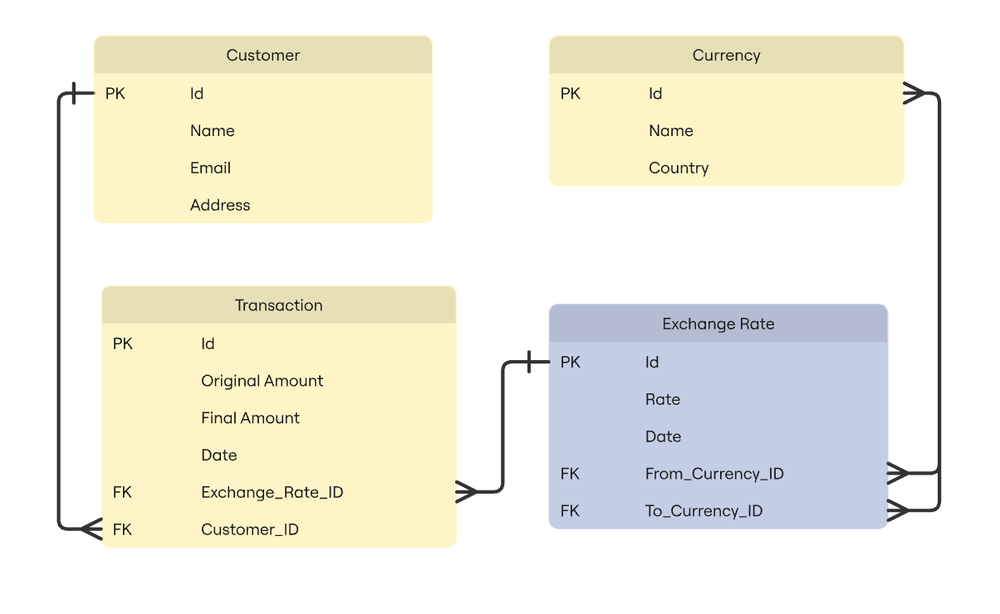

# Money Exchange System — Database Design

## Overview

Money exchange project for the MSE800 class. The Money Exchange System should allow an exchange business to manage customers, currencies, exchange rates, and currency exchange transactions.

## Entity-Relationship Diagram

The diagram presents the relations between each table of the database.

## Tables

### 1. Customer

This table is responsible for storing their personal information (necessary to link the transaction to the customer).

### 2. Currency

This table is responsible for storing the information from the specific currency (USD, EUR, BRL for example).

### 3. Exchange Rate

This table is responsible for storing the rate between the two currencies and the date of the exchange. It's referencing the currency twice to store the information about the original currency to the exchanged one.

### 4. Transaction

This table stores the information about a specific transaction, storing the original amount and the converted amount. Also, it links this to the customer and Exchange rate with the FKs.

## Design Decisions

I've created a table called Transaction in the ER Diagram, but since this is a reserved SQL keyword, I changed te table name to Exchange, keeping everything else as original.
