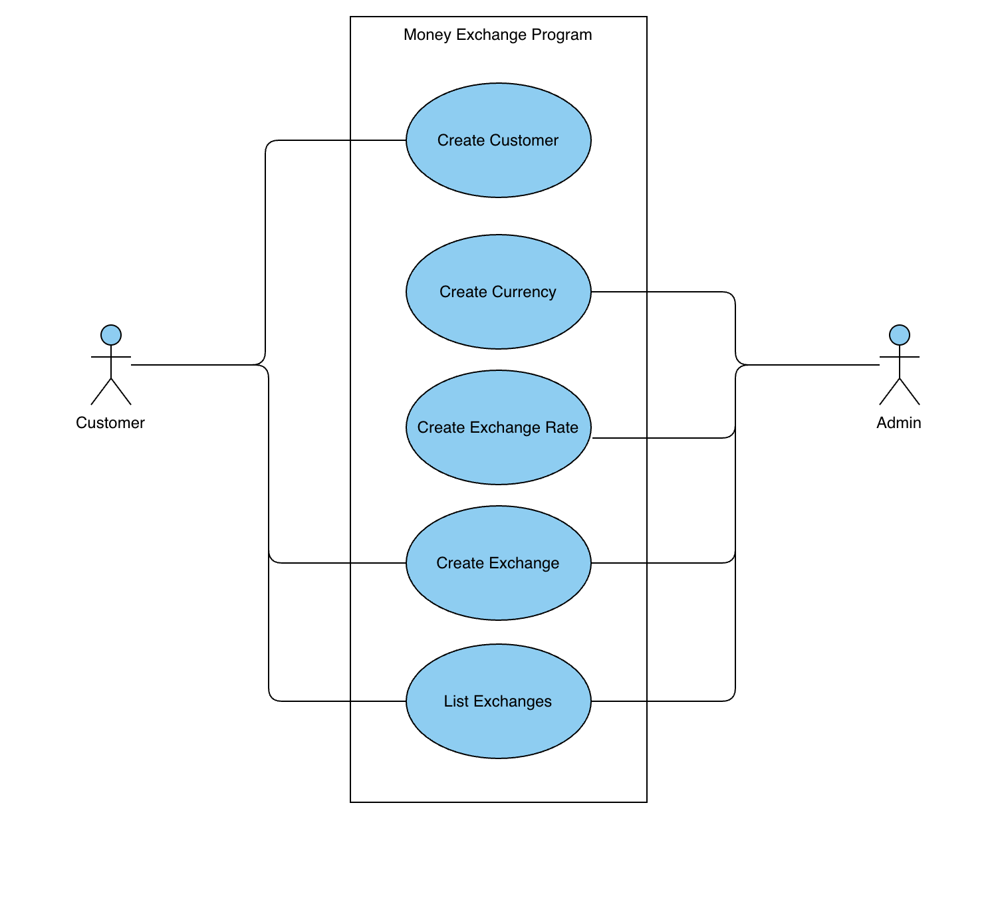

## Overview

Money exchange project for the MSE800 class. The Money Exchange System should allow an exchange business to manage customers, currencies, exchange rates, and currency exchange transactions.

## Use Case Diagram

The diagram shows two actors interacting with the Money Exchange Program:

- **Customer**: can create a customer record, create an exchange, and list exchanges.
- **Admin**: can create a currency, create an exchange rate, create an exchange, and list exchanges.

`Create Exchange` and `List Exchanges` are shared between both actors, while registering customers is Customer-only and managing currencies/rates is Admin-only.
