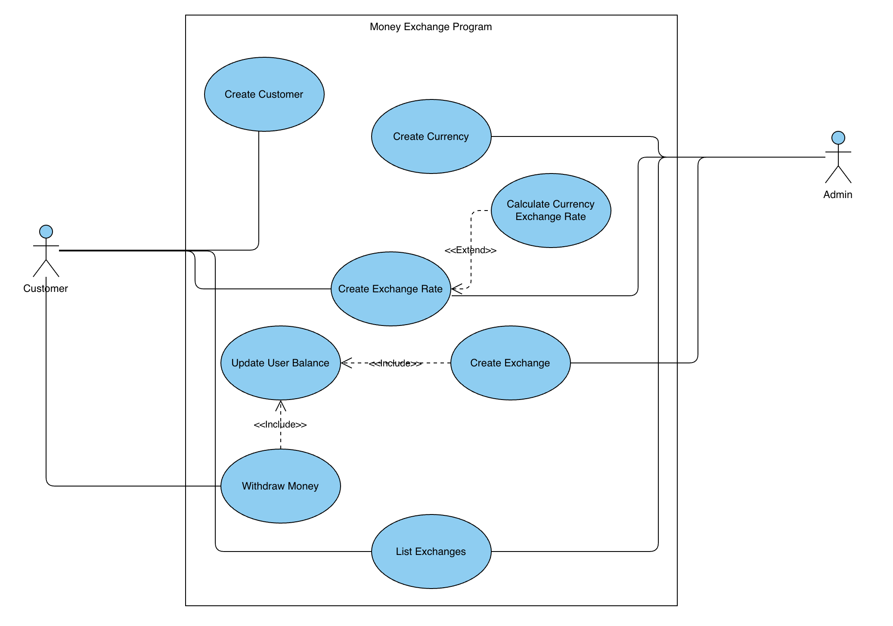

## Overview

Money exchange project for the MSE800 class. The Money Exchange System should allow an exchange business to manage customers, currencies, exchange rates, and currency exchange transactions.

## Use Case Diagram

The diagram shows two actors interacting with the Money Exchange Program:

- **Customer**: can create a customer record, create an exchange rate, create an exchange, withdraw money, and list exchanges.
- **Admin**: can create a currency, create an exchange rate, create an exchange, and list exchanges.

`Create Exchange Rate`, `Create Exchange`, and `List Exchanges` are shared between both actors, while registering customers and withdrawing money are Customer-only, and managing currencies is Admin-only.

This extended version adds two new use cases and three relationships between use cases:

- **`Calculate Currency Exchange Rate`** `<<extend>>` `Create Exchange Rate`: it's an optional step that only runs when the exchange rate needs to be calculated rather than entered directly.
- **`Update User Balance`** is `<<include>>` by both `Create Exchange` and `Withdraw Money`: it's a mandatory sub-step that always runs as part of either transaction, since both operations change the customer's balance.
